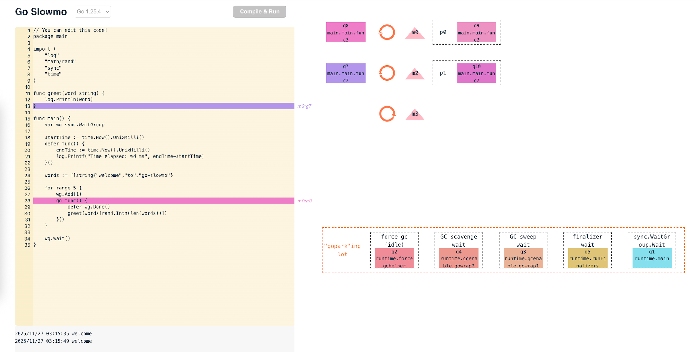

<p align="center">
  
</p>

# Go Slowmo

Visualize Go scheduler events at runtime.

<p align="center">
  
</p>

## How It Works

Simply put, a Go program is instrumented and visualized with the following steps:

1. the program is first compiled with the selected version of Go

2. the compiled ELF is then analyzed and attached with probes using [eBPF](https://ebpf.io/)

3. the compiled ELF is executed in a container with 2 vCPUs (i.e. gomaxprocs=2). When the compiled ELF is executed, the attached probes are triggered at specific PC and help capture important runtime states and events

4. the captured states and events are transmitted and consumed in stream manner


## Limitations

By uncovering and visualizing some of the core Go runtime concepts, this project aims to hopefully help Go users like myself to better understand and build with the language. But as a small piece of work, some limitations apply:

***Completeness:*** the Go scheduler (and the general Go runtime) does a lot of heavy lifting internally while offering ease of use to users, and this project has barely touched the tip of the iceberg. Specifically, programs with simple synchronization might be visualized fine, but other major types of scheduler event are absent at the moment. Events like network polling and preemption are still being actively worked on to make the visualization more complete.

***Capacity:*** for budget reason, the publicly hosted version of this project has limited capacity (long waiting time before a remote server is provisioned, limited max execution time for your code, etc.). If you find the visualization useful and want to tinker with it more, feel free to set it up and run locally (which eliminates all problems mentioned above) following some simple instructions in _"Running Locally"_ section below.

## Running Locally

Clone this repo with submodules:

```bash
git clone --recurse-submodules https://github.com/Kailun2047/go-slowmo.git
```

Make sure docker is available on your machine, and there are at least 4 CPUs available for use by docker.

Build and start all containers with:

```bash
docker compose up
```

To verify, run `docker ps` and make sure containers `go-slowmo-envoy-1`, `go-slowmo-slowmo-server-1`, `go-slowmo-exec-server-1` and `go-slowmo-slowmo-frontend-1` are up and running.

Then, open `http://127.0.0.1:50053` in browser.

## Inspirations

* [Loupe](https://github.com/latentflip/loupe) for the idea of runtime visualization
* [OpenTelemetry Go Instrumentation](https://github.com/open-telemetry/opentelemetry-go-instrumentation) for instrumenting Go code